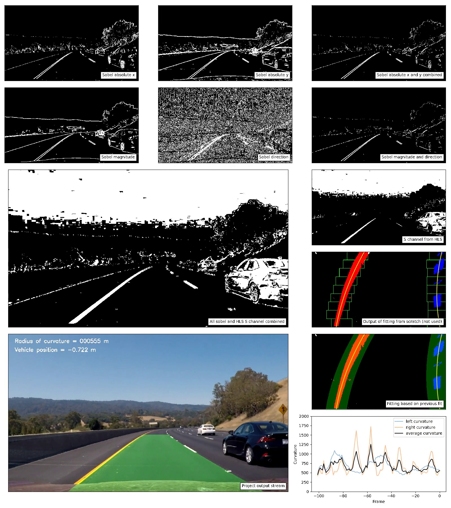

<h2>Table of Contents</h2>

<ul>
<li><a href="#sec-1">1. Camera Calibration</a></li>
<li><a href="#sec-2">2. Pipeline test images</a></li>
<li><a href="#sec-3">3. Pipeline video</a></li>
<li><a href="#sec-4">4. Discussion</a></li>
</ul>

# Camera Calibration

**1. Briefly state how you computed the camera matrix and distortion coefficients. Provide an example of a distortion corrected calibration image.**

The code for calibrating the camera and undistorting images are shown in `lane_lines.Chessboard` and `lane_lines.Calibration`. An example which runs the code is shown in `test_lane_lines.CalibrationTest.test_calibrate_camera_from_filename()`.

The calibration method works by analysing images of chessboards taken from different angles and distances (these were provided and are in `camera_cal`). The OpenCV function `findChessboardCorners` then detects the edges between the chessboard squares. The sets of these detected corners in multiple images are then fed into the OpenCV `calibrateCamera` function which, using the fact that in reality the corners are equally spaced, calculates and returns the calibration and distortion coefficients.

# Pipeline test images

**1. Provide an example of a distortion-corrected image**

Below is an image taken using the dashcam, before and after undistorting.

**2. Describe how (and identify where in your code) you used color transforms, gradients or other methods to create a thresholded binary image. Provide an example of a binary image result.**

I used several different values for thresholds and kernel sizes for the different sobel transformations, with the best combination being shown in the debug plot. The is code is in `lane_line_finding.Sobel`.

I also investigated the HLS colour space. The S (saturation) channel was very effective at identifying the yellow lane lines as can be seen in the debug video still. The code for converting to HLS, extracting S channel and applying a threshold is in `lane_line_finding.hls_select`.

The sobel outputs and the S colour space were combined with an and, so that if either method identified a pixel as possibly being part of a lane line, they were included in the output.

**3. Describe how (and identify where in your code) you performed a perspective transform and provide an example of a transformed image.**

The code for calculating and applying the perspective transform warp is in `lane_line_finding.PerspectiveTransform`. 

**4. Describe how (and identify where in your code) you identified lane-line pixels and fit their positions with a polynomial?**

The functions used to calculate the second order polynomial fit for the left and right lanes are `udacity.calculate_first_frame` and `udacity.calculate_subsequent_frame`. 

The first of these functions is used for the first frame and does this by creating a histogram of the bottom half of the perspective transform. It then uses the 2 maxima as the starting point of the left and right lanes. It then moves a sliding window in steps up the image to follow the lane line, it finally calculates the second order polynomial using the NumPy function `polyfit`. The output of this step is calculated for each debug frame (panel "Output of fitting from scratch (not used)"), though after the first frame the next method is used.

The subsequent frames are processed using `udacity.calculate_subsequent_frame` and the output is shown on the "Fitting based on previous fit" panel. This uses the previous fit as a starting point and so is much faster to compute.

**5. Describe how (and identify where in your code) you calculated the radius of curvature of the lane and the position of the vehicle with respect to center.**

The radius of curvature and position of the vehicle were calculated by the `udacity.calculate_curvature_and_position` function. The polynomial fits previously detected were converted into meters and the radius of curvature was calculated using the fitting coefficients.

The position of the vehicle was determined by first calculating the mean x position of the left and right lane from the polyfits. The mid point point between the lines was then calculated, and the position of the vehicle is the difference between this midpoint and the central point of the image in meters. This is displayed on the "Project output stream" panel. The negative value means that the car is on the left side of the lane.

**6. Provide an example image of your result plotted back down onto the road such that the lane area is identified clearly.**

This is on the "Project output stream" panel of the debug video still above.

# Pipeline video

**1. Provide a link to your final video output. Your pipeline should perform reasonably well on the entire project video (wobbly lines are ok but no catastrophic failures that would cause the car to drive off the road!)**

The main project video is [hosted on YouTube](https://youtu.be/ppaN8IdK0a0) as well as included in the repository (advancedlanelinefinding.mp4). A second debug video is also included which shows the results of the various stages of transformation that lead up to final image simultaneously ([YouTube](https://youtu.be/v5uqnKxBYmY) link, was too large for GitHub to accept).

# Discussion

-   I experimented with smoothing the polyfits over several previous frames, but in the end it seemed to reduce performance and so was scrapped.
-   Currently the program is quite sensitive to shadows. The issue here is that the S channel picks them up heavily. To fix this I would experiment combining this with an `and` to another colour space, perhaps YUV.
-   I initially used an off-center set of destination points for the perspective transform, this method actually performed better than the implementation I am submitting, but I couldn't calculate the position of the vehicle from that perspective transform as it was non-linearly distorted.
