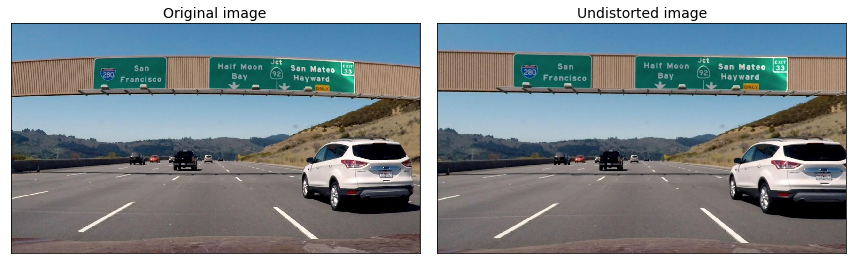

<h2>Table of Contents</h2>

<ul>
<li><a href="#sec-1">1. Camera Calibration</a></li>
<li><a href="#sec-2">2. Pipeline test images</a></li>
<li><a href="#sec-3">3. Pipeline video</a></li>
<li><a href="#sec-4">4. Discussion</a></li>
</ul>

# Camera Calibration

**1. Briefly state how you computed the camera matrix and distortion coefficients. Provide an example of a distortion corrected calibration image.**

The code for calibrating the camera and undistorting images are shown in `lane_lines.Chessboard` and `lane_lines.Calibration`. An example which runs the code is shown in `test_lane_lines.CalibrationTest.test_calibrate_camera_from_filename()`.

The calibration method works by analysing images of chessboards taken from different angles and distances (these were provided and are in `camera_cal`). The OpenCV function `findChessboardCorners` then detects the edges between the chess board squares. The sets of these detected corners in multiple images are then fed into the OpenCV `calibrateCamera` function which, using the fact that in reality the corners are equally spaced, calculates and returns the calibration and distortion coefficients.

# Pipeline test images

**1. Provide an example of a distortion-corrected image**

Below is an image taken using the dashcam, before and after undistorting.

**2. Describe how (and identify where in your code) you used color transforms, gradients or other methods to create a thresholded binary image. Provide an example of a binary image result.**

**3. Describe how (and identify where in your code) you performed a perspective transform and provide an example of a transformed image.**

**4. Describe how (and identify where in your code) you identified lane-line pixels and fit their positions with a polynomial?**

**5. Describe how (and identify where in your code) you calculated the radius of curvature of the lane and the position of the vehicle with respect to center.**

**6. Provide an example image of your result plotted back down onto the road such that the lane area is identified clearly.**

# Pipeline video

<iframe width="560" height="315" src="<https://www.youtube.com/embed/ppaN8IdK0a0>" frameborder="0" allowfullscreen></iframe>

<https://www.youtube.com/embed/ppaN8IdK0a0>

# Discussion
